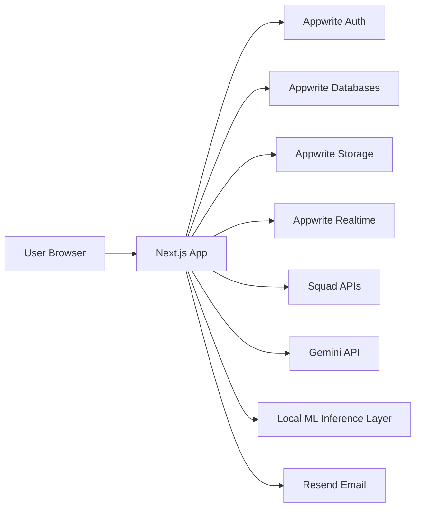
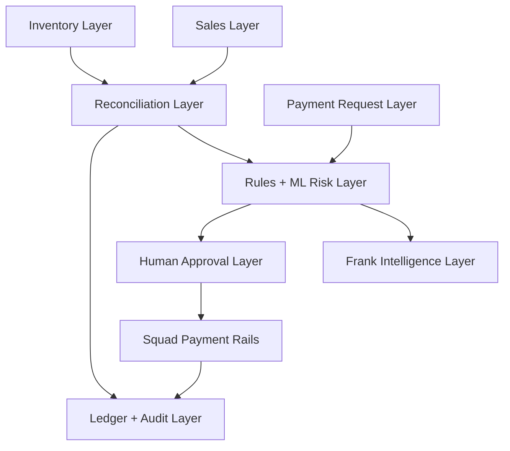

# Architecture Context

## Stack

| Layer | Technology | Role |
| --- | --- | --- |
| Framework | Next.js App Router + TypeScript | Product UI, route handlers, orchestration |
| UI | Tailwind CSS + shadcn/ui + Lucide | Admin and mobile product surfaces |
| Backend of Record | Appwrite | Auth, database, storage, realtime |
| Database | Appwrite Databases | Sales, inventory, payments, requests, alerts, audit data |
| File Storage | Appwrite Storage | Supporting files, proofs, generated training metadata if needed |
| Payment Rails | Squad APIs | POS collection, bank transfer events, payout flows |
| AI Reasoning | Gemini API | Frank explanations and natural-language responses |
| Document Understanding | PaddleOCR + LayoutLMv3 target stack, Gemini fallback in-app | Evidence OCR, invoice field extraction, and payable-account understanding |
| ML Training | Google Colab / Hugging Face notebook workflow | Pre-demo training for lightweight anomaly/risk models |
| Email | Resend | Alerts and workflow notifications |
| Validation | Zod | Input and model output validation |

## System Boundaries

- `app/` — route groups for auth, admin, mobile, and APIs
- `components/` — shared product components and feature UI
- `components/ui/` — shadcn/ui primitives
- `lib/appwrite/` — Appwrite clients, session, IDs
- `lib/squad/` — Squad API client and provider helpers
- `lib/inventory/` — stock movement and inventory logic
- `lib/sales/` — sale creation and money-in reconciliation logic
- `lib/payments/` — incoming payment and outgoing request orchestration
- `lib/verification/` — deterministic rules, score assembly, mismatch evaluation
- `lib/ml/` — model loading, feature mapping, inference helpers
- `lib/frank/` — Frank query tools and response orchestration
- `lib/ledger/` — ledger calculations and posting rules
- `lib/permissions/` — auth and role checks
- `lib/audit/` — audit event helpers
- `lib/email/` — notification helpers
- `context/` — product, architecture, UI, domain, workflow, and progress specs

## Runtime Architecture

All secret-bearing calls stay on the server side. The browser should never call Squad, Gemini, model hosting, or Appwrite admin APIs directly.

## Product Architecture View

This is the intended product story:

- sales create expected money-in
- Squad and manual records represent actual money-in
- inventory movement helps validate inventory-backed sales
- rules plus lightweight models score anomalies
- Frank explains and surfaces issues
- humans approve outgoing money
- Squad executes real or simulated movement
- ledger and audit close the loop

## Auth and Access Model

Appwrite Auth manages identity and session. Application roles are stored in membership records.

### Roles

- `super_admin`
- `sales_operator`
- `field_employee`

### Access Rules

1. Every authenticated user belongs to one active organization in MVP.
2. `super_admin` can view and operate across the organization.
3. `sales_operator` can create and review their sales-related work, but not approve outgoing payments.
4. `field_employee` can create outgoing requests for vendors, staff cash, airtime/data, utilities, and reimbursements, then upload proof when required.
5. Manual incoming payment confirmation is `super_admin` only in this phase.
6. All authorization is enforced server-side.

## Squad Integration Architecture

Squad must feel central to the product, not bolted on.

### Money In

Supported collection sources:

- POS payment
- bank transfer through the static organization-level Squad Virtual Account
- manual record
- cash record

Preferred truth model:

- expected money comes from `sale`
- actual money comes from Squad when available
- manual/cash entries are supported as secondary paths

### Clean POS Flow

1. `sales_operator` creates sale.
2. Cline creates or references a POS collection request, or references the static Squad Virtual Account for bank-transfer sales.
3. Squad reports the payment result.
4. Cline records incoming payment.
5. Reconciliation compares sale amount to actual received amount.
6. Sale status becomes `paid` or `mismatch_flagged`.

### Static Virtual Account Flow

1. Cline resolves a stable organization-level Squad business virtual account for the Super Admin workspace.
2. The static virtual account is shown as the canonical Cline collection account in admin and transfer-payment surfaces.
3. Squad virtual-account webhooks are preserved idempotently and verified when webhook secrets are configured.
4. Sale-specific bank-transfer reconciliation can reference the static account while still matching exact amounts through controlled Cline actions in the demo phase.

### Flagged Money-In Flow

1. Sale exists.
2. Inventory is reduced for `inventory_sale`.
3. Matching payment is absent or inconsistent.
4. Reconciliation engine emits mismatch.
5. Risk layer and Frank surface the issue.

### Money Out

Supported outgoing request types:

- `vendor_payment`
- `staff_cash_request`
- `airtime_data_request`
- `utility_payment`
- `manual_business_expense`

Approval sequence:

1. Validate role and request state.
2. Run deterministic rules and model scoring.
3. Surface explanation and risk context.
4. Require `super_admin` decision.
5. Execute or simulate Squad payout.
6. Record final status and audit trail.

### Webhooks and Requeries

Webhook handlers must:

1. verify authenticity when possible
2. be idempotent
3. preserve raw payloads
4. map provider events back to known records
5. update ledger and status through controlled handlers

## Inventory Architecture

Inventory is intentionally lightweight.

Supported behavior:

- product catalog
- stock quantity on hand
- stock-in records
- stock reduction through `inventory_sale`
- low-stock visibility

Out of scope:

- branches
- multi-warehouse logic
- batch/expiry tracking
- supplier PO lifecycle
- advanced returns

## AI and ML Architecture

## Key Principle

Frank is not the model. Frank is the intelligence experience over data, rules, and model outputs.

### Reasoning Layer

Gemini is used for:

- natural-language explanations
- business question responses
- summaries
- alert wording

Gemini should answer from structured query outputs and stored evaluation artifacts. It should not invent financial facts.

### Trained Model Layer

For this phase, the AI training story includes:

- `PaddleOCR` for noisy invoice, receipt, POS-slip, and bill text extraction
- `LayoutLMv3` for pretrained document understanding over semi-structured financial evidence
- `all-MiniLM-L6-v2` for lightweight purpose/expense semantic classification
- `Isolation Forest` for anomaly detection
- `XGBoost` or `LightGBM` for risk scoring

Training setup:

- trained beforehand in Colab or a similar notebook workflow
- based on synthetic but realistic scenario data
- artifacts saved and referenced by the app/demo
- no live retraining during the demo
- the Next.js app keeps a server-side extraction boundary so Gemini can act as a demo fallback until a PaddleOCR/LayoutLM service is deployed

Model outputs:

- extracted evidence fields
- document confidence
- verified account-name match signals
- transaction category hints
- anomaly score
- risk score
- optional risk band

Models do not:

- approve
- reject
- transfer money
- answer business KPI questions on their own

### Feature Engineering

Likely input features include:

- sale amount
- payment amount
- amount deviation
- sale type
- payment source
- stock reduced or not
- payment recorded or not
- request frequency
- duplicate evidence hints
- invoice account number and account name match
- Squad account lookup result
- OCR confidence
- extracted invoice amount versus requested amount
- timing gaps
- actor/role behavior markers

### Deterministic Rules

Rules remain first-class.

Examples:

- sale exists but payment missing
- inventory reduced without corresponding payment
- payment amount differs from expected sale amount
- vendor request lacks supporting file
- vendor invoice OCR cannot find payable account details
- invoice account differs from known vendor account
- Squad account lookup name conflicts with invoice or vendor name
- extracted invoice total differs from requested payout amount
- repeated staff cash request frequency spike

### Frank Query Tools

Frank business Q&A must come from query tools such as:

- `getRevenueByPeriod(period)`
- `getFlaggedTransactions()`
- `getSaleMismatchDetails(saleId)`
- `getPendingPaymentRequests()`
- `getVendorPaymentHistory(vendorId)`
- `getRequestRiskExplanation(requestId)`

## Ledger and Audit Architecture

Ledger is append-only.

Use ledger entries for:

- incoming money
- outgoing money
- reservations
- releases

Audit events should exist for:

- sale creation
- stock movement
- incoming payment recorded
- mismatch flagged
- payment request submitted
- request approved or rejected
- Squad callbacks/requeries
- Frank-relevant risk evaluations when needed

## UI Architecture

### Route Surfaces

- `app/(auth)/` — sign in and auth
- `app/(admin)/` — `super_admin` desktop-first control room
- `app/(mobile)/` — simplified role-driven flows for `sales_operator` and `field_employee`

### Primary Experience

The product should feel like an operational console, not a landing page.

Main surfaces:

- admin dashboard
- sales entry and sale detail
- inventory list/detail
- incoming payment / mismatch views
- payment request queue and detail
- Frank panel and alerts

## Implementation Priorities

1. role-aware shells and seeded demo data
2. inventory foundations
3. sale creation
4. clean POS sale confirmation flow
5. mismatch detection flow
6. outgoing request flows
7. Frank explanation and business Q&A
8. trained-model artifact integration
9. demo polish
