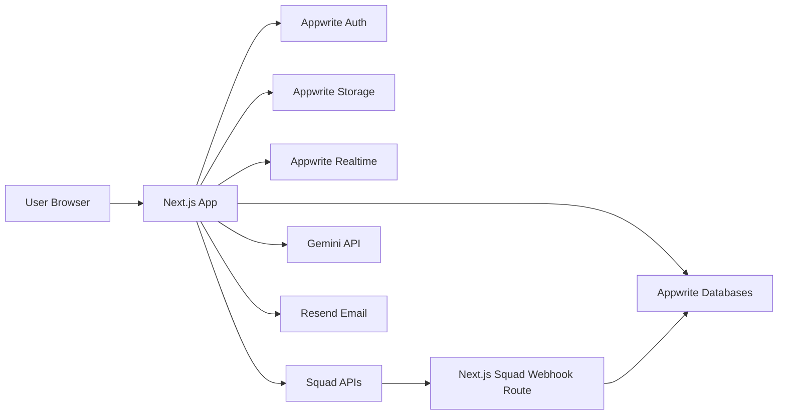

# Architecture Context

## Stack

| Layer | Technology | Role |
| --- | --- | --- |
| Framework | Next.js App Router + TypeScript | Product UI, server routes, server actions, API orchestration |
| UI | Tailwind CSS + shadcn/ui + Lucide | Responsive dashboard, mobile request flows, accessible components |
| Backend of Record | Appwrite | Auth, database, storage, realtime subscriptions |
| Database | Appwrite Databases | Organizations, users, requests, vendors, ledger, alerts, audit data |
| File Storage | Appwrite Storage | Private invoice, proof, and organization document uploads |
| Payments | Squad sandbox APIs | Virtual accounts, account lookup, transfers, requery, webhooks |
| AI Extraction | Gemini API | Structured invoice/proof extraction and low-confidence summaries |
| AI Assistant | Gemini API | Frank chat responses over server-side query tools |
| Email | Resend | Critical alerts, proof requests, proof overdue reminders, digests |
| Validation | Zod | Input validation at server boundaries and Gemini output validation |

## System Boundaries

- `app/` — Next.js routes, layouts, role dashboards, server actions, API routes.
- `components/` — shared product components and feature-specific UI.
- `components/ui/` — generated shadcn/ui primitives. Avoid direct modification unless explicitly needed.
- `lib/appwrite/` — Appwrite client creation, session helpers, server SDK helpers, collection IDs.
- `lib/squad/` — Squad API client, account lookup, transfers, requery, webhook verification helpers.
- `lib/gemini/` — Gemini client, structured extraction prompts, Frank prompt/tool orchestration.
- `lib/verification/` — deterministic Trust Score and Reconciliation Score rules.
- `lib/ledger/` — wallet ledger calculations, reservations, balance derivation, reconciliation helpers.
- `lib/permissions/` — role and organization access checks.
- `lib/email/` — Resend templates and send helpers.
- `lib/audit/` — audit event creation and immutable timeline helpers.
- `context/` — product, architecture, UI, domain, workflow, and progress specs.

## Runtime Architecture

Next.js owns all secret-bearing operations. Squad keys, Gemini keys, Resend keys, and Appwrite server keys never reach the browser.

## Auth and Access Model

Appwrite Auth manages identities and sessions. Application roles are stored in profile/member records, not inferred from email.

### Roles

- `super_admin`
- `department_head`
- `field_employee`

### Access Rules

1. Every authenticated user belongs to exactly one active organization in MVP.
2. Super Admin can access every organization record, department, request, vendor, alert, transaction, and audit event for their organization.
3. Department Head can access only their department's requests, proofs, and visible budget summary.
4. Field Employee can access only their own requests, proof tasks, and profile.
5. All mutations must enforce auth, organization membership, and role before doing business logic.
6. Client-side hiding is never treated as authorization.

## Squad Integration Architecture

### Inbound Funding

- Each organization gets a Squad virtual account for master wallet funding.
- Admin funds the organization wallet by bank transfer into that virtual account.
- Squad webhook creates an inbound ledger entry.
- During sandbox demo, a simulated funding entry may be created, clearly marked as sandbox/manual.

### Account Lookup

- Before a vendor or employee transfer, Cline calls Squad account lookup with `bank_code` and `account_number`.
- Resolved account name is stored in verification evidence.
- Vendor records remember submitted names and resolved account names for future mismatch detection.

### Outbound Transfers

- All outbound payments use Squad Transfer API.
- Amounts are sent in kobo.
- Every transfer reference must be unique and include the Squad Merchant ID.
- Cline never initiates transfer until a Super Admin approval action occurs.
- Approval sequence:
  1. Validate request state.
  2. Recalculate available balance from ledger.
  3. Create ledger reservation.
  4. Generate Squad transfer reference.
  5. Call Squad transfer.
  6. Store raw Squad response.
  7. Mark transfer pending/success/failed from response.
  8. Confirm final state through webhook or requery.
  9. Finalize or release reservation.

### Transfer Requery and Retry

- If status is uncertain, Cline re-queries Squad before retrying.
- Manual retry is Super Admin-only.
- Retry must use a new Squad transaction reference.
- Every retry is an audit event.
- No automatic retry in MVP.

### Webhooks

Webhook routes must:

1. Verify webhook authenticity when Squad provides a verification method.
2. Be idempotent by event ID, transaction reference, and payment reference.
3. Store raw payloads for audit.
4. Update ledger and transaction status only through controlled handlers.
5. Ignore or flag payloads that do not map to known organization/request references.

## AI Architecture

## Deterministic Rules First

The final Trust Score and Reconciliation Score are calculated by Cline code. Gemini may extract, summarize, and explain. Gemini never approves, rejects, edits budgets, edits vendors, initiates transfers, or overrides score calculations.

### Gemini Jobs

- Extract invoice fields into JSON.
- Extract proof/receipt fields into JSON.
- Summarize a request's risk report in natural language.
- Answer Frank questions using server-side query tool results.
- Draft alert language.

### Validation

Every Gemini structured output must be parsed and validated before being stored. If extraction is low-confidence or invalid, Cline stores the failure and flags manual review.

### Stored AI Evidence

Each verification run stores:

- uploaded file IDs and hashes
- extracted fields
- extraction confidence
- model name/version
- prompt or prompt version
- Squad lookup result
- rule results
- score breakdown
- generated explanation
- timestamp
- triggering user/action

## Trust Score Architecture

### Vendor Invoice Trust Score

Weighted total: 100 points.

- Account name match: 25
- Invoice extraction match: 20
- Duplicate risk: 20
- Budget pressure: 10
- Amount anomaly: 15
- Vendor history and policy: 10

### Field Cash Trust Score

Weighted total: 100 points.

- Employee history: 25
- Amount normality: 25
- Budget pressure: 20
- Request frequency: 15
- Policy fit: 15

### Field Proof Reconciliation Score

Calculated after field cash payout and proof upload.

- Proof amount vs approved amount.
- Proof date/time vs request.
- Merchant/category fit.
- Duplicate proof hash.
- Clarity/readability.
- Suspicious mismatch flags.

### Risk Bands

- 80-100: low concern
- 60-79: needs review
- 40-59: high concern
- 0-39: critical concern

Labels must not imply AI approval. Use `low concern`, `needs review`, `high concern`, and `critical concern`.

## Frank Architecture

Frank is read-only and tool/query based.

### Query Tools

Server-side query functions expose limited, structured data:

- `getDepartmentSpend(period, departmentId)`
- `searchPayments(filters)`
- `getVendorHistory(vendorNameOrAccount)`
- `getBudgetVariance(period)`
- `getPendingRiskSummary()`
- `getRequestExplanation(requestId)`
- `getProofOverdueSummary()`

The app sends only tool results to Gemini for explanation. It does not dump the full database into the model.

### Alert Generation

Rules engine and scheduled checks create alert records for:

- duplicate invoice
- budget pace warning
- vendor identity mismatch
- request burst
- high-value request
- proof overdue or proof mismatch

Alerts appear in Frank chat, dashboard alert feed, and email depending on severity.

## Storage Model

### Appwrite Databases

Stores structured data:

- organizations
- organization members
- departments
- spend policies
- budgets
- payment requests
- request evidence
- verification runs
- vendors
- employee bank profiles
- ledger entries
- transfers
- webhooks
- audit events
- Frank messages
- alerts
- reports/exports metadata

### Appwrite Storage

Private buckets:

- `invoices`
- `proofs`
- `org-documents`

Files must have metadata rows with owner, organization, request, bucket, MIME type, size, hash, and created timestamp.

## Internal Wallet Ledger

Cline maintains an internal ledger derived from immutable entries. The displayed wallet balance is never manually edited.

Ledger entry types:

- inbound funding
- sandbox funding adjustment
- reservation
- reservation release
- transfer debit
- transfer failure release
- reversal
- correction

Balance is calculated from finalized and reserved entries. If Cline and Squad disagree, create a reconciliation alert rather than silently mutating history.

## Request Status Lifecycle

Primary lifecycle:

`draft -> submitted -> ai_verifying -> awaiting_admin -> more_proof_requested -> approved -> transfer_pending -> paid`

Vendor invoice path:

`paid -> closed`

Field cash path:

`paid -> proof_required -> proof_under_review -> closed`

Failure and exception statuses:

- `rejected`
- `transfer_failed`
- `proof_flagged`
- `proof_overdue`
- `cancelled`

## Invariants

1. No auto-approval exists in MVP.
2. No transfer occurs without a Super Admin approval audit event.
3. Gemini output is never trusted until validated by code.
4. Trust Scores are deterministic and explainable.
5. Secrets never reach the browser.
6. Wallet balance is derived from ledger entries.
7. Squad transfer references are unique and include Merchant ID.
8. Retry uses a new transfer reference.
9. Webhook handlers are idempotent.
10. Audit events are append-only.
11. Files are private and only accessed through authorized flows.
12. Role checks happen server-side before every mutation.

## Implementation Phases

### Phase 0: Context and Project Scaffold

- Lock product, architecture, UI, domain model, and workflow docs.
- Scaffold Next.js, TypeScript, Tailwind, shadcn/ui, Appwrite SDK.
- Create environment schema.

### Phase 1: Auth, Org Setup, and Demo Data

- Appwrite Auth integration.
- Organization onboarding.
- Departments, budgets, policies.
- Seed Express Travels demo data and users.

### Phase 2: Storage and Request Submission

- Appwrite Storage buckets.
- Shared request submission flow.
- Vendor invoice upload.
- Field cash request.
- Request list per role.

### Phase 3: Squad Account Lookup and Verification

- Squad client.
- Account lookup.
- Gemini extraction.
- Vendor invoice Trust Score.
- Field cash Trust Score.
- Verification evidence storage.

### Phase 4: Admin Dashboard and Detail Page

- Pending approval queue.
- Request detail evidence view.
- Approve, reject, request more proof.
- Audit timeline.

### Phase 5: Ledger and Transfers

- Internal ledger.
- Balance display.
- Reservation flow.
- Squad transfer.
- Requery and manual retry.
- Webhook handler.

### Phase 6: Field Proof Reconciliation

- Proof upload.
- Gemini proof extraction.
- Reconciliation Score.
- Proof overdue handling.
- Proof mismatch alerts.

### Phase 7: Frank and Alerts

- Frank chat UI.
- Server-side query tools.
- Proactive alert generation.
- Dashboard badges/feed.
- Resend emails for critical alerts and proof requests.

### Phase 8: Reports, Polish, and Demo Readiness

- Budget vs actual report.
- Exportable ledger CSV.
- Responsive QA.
- Seeded demo walkthrough.
- Error states, loading states, empty states.
