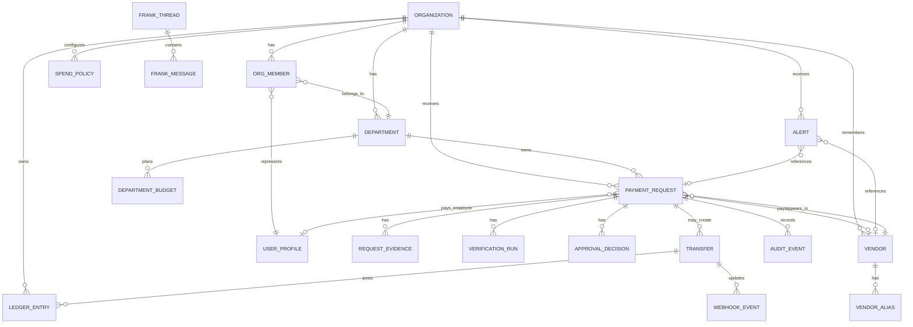

# Domain Model

This file defines Cline's core entities, relationships, and important collection fields. Appwrite collection names can be adjusted during implementation, but the domain concepts should stay stable unless the product scope changes.

## Entity Relationship Overview

## Core Entities

### Organization

Represents one SME/business workspace.

Important fields:

- `id`
- `name`
- `businessType`
- `currency` fixed to `NGN`
- `squadCustomerIdentifier`
- `squadVirtualAccountNumber`
- `squadVirtualAccountBankCode`
- `squadVirtualAccountBankName`
- `walletMode`: `sandbox` or `live`
- `createdBy`
- `createdAt`
- `updatedAt`

Relationships:

- has many members
- has many departments
- has many requests
- has one active spend policy
- has many ledger entries

### User Profile

Application profile for an Appwrite Auth user.

Important fields:

- `id`
- `appwriteUserId`
- `name`
- `email`
- `phone`
- `avatarFileId`
- `createdAt`
- `updatedAt`

### Organization Member

Connects a user to an organization and defines their role.

Important fields:

- `id`
- `organizationId`
- `userProfileId`
- `departmentId`
- `role`: `super_admin`, `department_head`, `field_employee`
- `status`: `active`, `invited`, `disabled`
- `createdAt`
- `updatedAt`

Rules:

- MVP assumes one active organization per user.
- Field employees and department heads must have a department.
- Super Admin may have no department or may belong to Finance.

### Employee Bank Profile

Stores payout details for users who may receive field cash transfers.

Important fields:

- `id`
- `organizationId`
- `userProfileId`
- `bankCode`
- `bankName`
- `accountNumber`
- `resolvedAccountName`
- `lastLookupAt`
- `isVerified`
- `createdAt`
- `updatedAt`

Rules:

- Squad account lookup should verify employee account details before first payout.
- Bank details changes must create audit events.

### Department

Represents an internal business unit.

Important fields:

- `id`
- `organizationId`
- `name`
- `description`
- `status`: `active`, `archived`
- `createdAt`
- `updatedAt`

### Department Budget

Monthly planning number for a department.

Important fields:

- `id`
- `organizationId`
- `departmentId`
- `month`: `YYYY-MM`
- `plannedAmountKobo`
- `createdBy`
- `createdAt`
- `updatedAt`

Rules:

- Budgets are not hard limits.
- Budget pressure affects score and alerts.

### Spend Policy

Organization-level policy settings.

Important fields:

- `id`
- `organizationId`
- `highValueThresholdKobo`
- `invoiceRequiredForVendorPayments`
- `fieldProofDeadlineHours`
- `allowedCategories`
- `active`
- `createdAt`
- `updatedAt`

### Vendor

Reusable recipient record for vendor invoice payments.

Important fields:

- `id`
- `organizationId`
- `displayName`
- `bankCode`
- `bankName`
- `accountNumber`
- `resolvedAccountName`
- `status`: `normal`, `watchlist`, `blocked`
- `firstSeenAt`
- `lastPaidAt`
- `totalPaidKobo`
- `notes`
- `createdAt`
- `updatedAt`

Rules:

- Same account number with different submitted names should produce a flag.
- Blocked vendors cannot be paid until unblocked.
- Watchlist vendors can be paid but must be visibly flagged.

### Vendor Alias

Tracks alternate submitted names for a vendor.

Important fields:

- `id`
- `organizationId`
- `vendorId`
- `submittedName`
- `sourceRequestId`
- `firstSeenAt`

### Payment Request

Central entity for vendor and field payments.

Important fields:

- `id`
- `organizationId`
- `departmentId`
- `submittedByMemberId`
- `requestType`: `vendor_invoice`, `field_cash`
- `status`
- `amountKobo`
- `category`
- `reason`
- `recipientType`: `vendor`, `employee`
- `vendorId`
- `employeeProfileId`
- `submittedVendorName`
- `submittedBankCode`
- `submittedAccountNumber`
- `trustScore`
- `concernLevel`: `low_concern`, `needs_review`, `high_concern`, `critical_concern`
- `topFlags`
- `proofDeadlineAt`
- `createdAt`
- `updatedAt`
- `submittedAt`
- `closedAt`

Rules:

- All submitted requests must reach `awaiting_admin`.
- Approval is Super Admin-only.
- Trust Score is informational.

### Request Evidence

Uploaded invoice/proof/vendor document metadata.

Important fields:

- `id`
- `organizationId`
- `requestId`
- `uploadedByMemberId`
- `evidenceType`: `invoice`, `field_proof`, `vendor_document`, `delivery_proof`, `bank_screenshot`
- `storageBucket`
- `fileId`
- `fileName`
- `mimeType`
- `sizeBytes`
- `sha256`
- `extractionStatus`: `pending`, `extracted`, `failed`, `manual_review`
- `createdAt`

Rules:

- File metadata is stored in database.
- File bytes live in Appwrite Storage.
- Duplicate checks use file hashes.

### Verification Run

Stores AI extraction plus deterministic rule results.

Important fields:

- `id`
- `organizationId`
- `requestId`
- `runType`: `initial_trust_score`, `proof_reconciliation`, `manual_recheck`
- `modelName`
- `promptVersion`
- `extractedFields`
- `extractionConfidence`
- `squadLookupResult`
- `ruleResults`
- `scoreBreakdown`
- `finalScore`
- `concernLevel`
- `flags`
- `recommendation`
- `createdAt`

Rules:

- Store raw structured extraction and final rule output.
- Never overwrite previous runs; create a new run.

### Approval Decision

Records Super Admin decisions.

Important fields:

- `id`
- `organizationId`
- `requestId`
- `decidedByMemberId`
- `decision`: `approved`, `rejected`, `more_proof_requested`
- `message`
- `createdAt`

Rules:

- Reject and request-more-proof require a message.
- Approve creates an audit event and begins transfer flow.

### Transfer

Represents a Squad payout attempt.

Important fields:

- `id`
- `organizationId`
- `requestId`
- `transferReference`
- `squadTransactionReference`
- `nipTransactionReference`
- `amountKobo`
- `bankCode`
- `accountNumber`
- `accountName`
- `status`: `created`, `pending`, `success`, `failed`, `reversed`, `uncertain`
- `rawSquadResponse`
- `attemptNumber`
- `createdAt`
- `updatedAt`

Rules:

- Retry creates a new transfer record with a new reference.
- Do not reuse transaction references.

### Ledger Entry

Immutable wallet accounting row.

Important fields:

- `id`
- `organizationId`
- `requestId`
- `transferId`
- `entryType`
- `direction`: `credit`, `debit`, `reservation`
- `amountKobo`
- `status`: `pending`, `posted`, `released`, `reversed`
- `description`
- `reference`
- `createdAt`

Entry types:

- `inbound_funding`
- `sandbox_funding_adjustment`
- `reservation`
- `reservation_release`
- `transfer_debit`
- `transfer_failure_release`
- `reversal`
- `correction`

Rules:

- Balance is calculated from ledger entries.
- Ledger entries are append-only.

### Webhook Event

Stores incoming Squad webhook payloads.

Important fields:

- `id`
- `provider`: `squad`
- `eventType`
- `providerEventId`
- `reference`
- `payload`
- `processingStatus`: `received`, `processed`, `ignored`, `failed`
- `receivedAt`
- `processedAt`

Rules:

- Webhook processing is idempotent.
- Raw payloads are retained.

### Audit Event

Append-only user/system timeline.

Important fields:

- `id`
- `organizationId`
- `actorMemberId`
- `actorType`: `user`, `system`, `squad`, `gemini`, `frank`
- `entityType`
- `entityId`
- `eventType`
- `summary`
- `metadata`
- `createdAt`

Rules:

- Audit events are never edited or deleted by app workflows.
- Important mutations must create audit events.

### Alert

Frank/dashboard/email alert record.

Important fields:

- `id`
- `organizationId`
- `alertType`
- `severity`: `info`, `warning`, `critical`
- `title`
- `message`
- `requestId`
- `vendorId`
- `departmentId`
- `status`: `unread`, `read`, `dismissed`
- `emailStatus`: `not_needed`, `queued`, `sent`, `failed`
- `createdAt`
- `readAt`

### Frank Thread

Conversation container for Super Admin.

Important fields:

- `id`
- `organizationId`
- `createdByMemberId`
- `title`
- `createdAt`
- `updatedAt`

### Frank Message

Stores chat messages and proactive alert messages.

Important fields:

- `id`
- `organizationId`
- `threadId`
- `sender`: `admin`, `frank`, `system`
- `messageType`: `chat`, `alert`, `summary`
- `content`
- `toolCalls`
- `relatedAlertId`
- `createdAt`

## Status Reference

Payment request statuses:

- `draft`
- `submitted`
- `ai_verifying`
- `awaiting_admin`
- `more_proof_requested`
- `approved`
- `transfer_pending`
- `paid`
- `proof_required`
- `proof_under_review`
- `proof_overdue`
- `proof_flagged`
- `closed`
- `rejected`
- `transfer_failed`
- `cancelled`

Transfer statuses:

- `created`
- `pending`
- `success`
- `failed`
- `reversed`
- `uncertain`

Vendor statuses:

- `normal`
- `watchlist`
- `blocked`

## Seed Demo Data

Organization:

- Express Travels

Departments:

- Procurement
- Logistics
- Operations
- Finance

Users:

- Super Admin: Ada Finance
- Department Head: Tola Procurement
- Department Head: Musa Logistics
- Field Employee: Ibrahim Driver

Example vendors:

- Chidi Prints Ltd
- Mainland Motors
- Ope Fuel Services

Example scenarios:

- Vendor invoice with account name mismatch.
- Vendor invoice duplicate.
- Field fuel request with later matching proof.
- Field proof overdue.
- Logistics budget pace warning.
