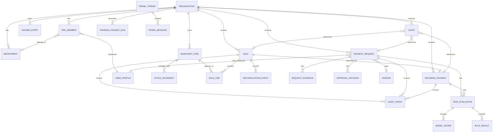

# Domain Model

This file defines the current core entities for the demo-first finance operating system build. The old spend-only model is no longer the center of the product.

## Entity Relationship Overview

## Core Entities

### Organization

Represents one SME workspace.

Important fields:

- `id`
- `name`
- `businessType`
- `currency` fixed to `NGN`
- `walletMode`: `sandbox` or `live`
- `createdBy`
- `createdAt`
- `updatedAt`

### User Profile

Application profile for an Appwrite Auth user.

Important fields:

- `id`
- `appwriteUserId`
- `name`
- `email`
- `phone`
- `createdAt`
- `updatedAt`

### Organization Member

Connects a user to an organization and assigns a role.

Important fields:

- `id`
- `organizationId`
- `userProfileId`
- `departmentId`
- `role`: `super_admin`, `sales_operator`, `field_employee`
- `status`: `active`, `invited`, `disabled`
- `createdAt`
- `updatedAt`

Rules:

- one active organization per user in MVP
- `field_employee` can belong to a department when money-out context needs it
- `sales_operator` does not require a department

### Department

Used only for money-out accountability in the current scope.

Important fields:

- `id`
- `organizationId`
- `name`
- `description`
- `status`: `active`, `archived`
- `createdAt`
- `updatedAt`

### Vendor

Reusable recipient record for vendor payments.

Important fields:

- `id`
- `organizationId`
- `displayName`
- `bankCode`
- `bankName`
- `accountNumber`
- `resolvedAccountName`
- `status`: `normal`, `watchlist`, `blocked`
- `firstSeenAt`
- `lastPaidAt`
- `totalPaidKobo`
- `notes`
- `createdAt`
- `updatedAt`

### Inventory Item

Lightweight stock entity for product-backed sales.

Important fields:

- `id`
- `organizationId`
- `sku`
- `name`
- `description`
- `unitPriceKobo`
- `quantityOnHand`
- `lowStockThreshold`
- `status`: `active`, `archived`
- `createdAt`
- `updatedAt`

Rules:

- inventory is organization-level
- no branch ownership
- no batch, expiry, or warehouse-transfer complexity in this phase

### Stock Movement

Immutable stock event.

Important fields:

- `id`
- `organizationId`
- `inventoryItemId`
- `type`: `stock_in`, `sale_out`, `adjustment`
- `quantityDelta`
- `unitPriceKobo`
- `saleId`
- `reason`
- `createdBy`
- `createdAt`

### Sale

Primary expected-revenue object.

Important fields:

- `id`
- `organizationId`
- `createdByMemberId`
- `saleType`: `inventory_sale`, `service_sale`, `manual_sale`
- `title`
- `customerLabel`
- `expectedAmountKobo`
- `status`: `pending_payment`, `paid`, `mismatch_flagged`
- `paymentSourceExpected`: `bank_transfer`, `pos_payment`, `cash`, `manual_record`
- `bankTransferReference`
- `bankTransferAccountNumber`
- `bankTransferAccountName`
- `bankTransferBankName`
- `bankTransferExpiresAt`
- `notes`
- `createdAt`
- `updatedAt`

Rules:

- `sales_operator` and `super_admin` can create sales
- no partial-payment model in this phase
- one sale reconciles to one expected amount
- bank-transfer sales should reference the static organization-level Squad Virtual Account details when available

### Sale Line

Line items for a sale.

Important fields:

- `id`
- `organizationId`
- `saleId`
- `kind`: `inventory_item`, `service_item`, `manual_item`
- `inventoryItemId`
- `label`
- `quantity`
- `unitPriceKobo`
- `lineTotalKobo`

Rules:

- `inventory_sale` must have at least one line with `inventoryItemId`
- `service_sale` and `manual_sale` do not require stock linkage

### Incoming Payment

Actual received-money record.

Important fields:

- `id`
- `organizationId`
- `saleId`
- `sourceType`: `bank_transfer`, `pos_payment`, `cash`, `manual_record`
- `amountKobo`
- `status`: `recorded`, `matched`, `mismatch_flagged`, `unclassified`
- `provider`: `squad`, `manual`
- `providerReference`
- `recordedByMemberId`
- `recordedAt`
- `createdAt`
- `updatedAt`

Rules:

- Squad-originated records are system-created when possible
- manual incoming records are `super_admin` controlled in this phase
- incoming money may exist without a sale and be marked `unclassified`
- the Super Admin workspace has one stable organization-level Squad virtual account used as the canonical Cline collection account
- sale-specific transfer records can reference that static account while reconciliation remains tied to exact sale amount and controlled confirmation

### Reconciliation Event

Captures expected-vs-actual money-in checks.

Important fields:

- `id`
- `organizationId`
- `saleId`
- `incomingPaymentId`
- `outcome`: `matched`, `amount_mismatch`, `missing_payment`, `unclassified_payment`
- `expectedAmountKobo`
- `actualAmountKobo`
- `summary`
- `createdAt`

### Payment Request

Primary outgoing money object.

Important fields:

- `id`
- `organizationId`
- `createdByMemberId`
- `departmentId`
- `requestType`: `vendor_payment`, `staff_cash_request`, `airtime_data_request`, `utility_payment`, `manual_business_expense`
- `title`
- `reason`
- `amountKobo`
- `status`: `submitted`, `approved`, `rejected`
- `vendorId`
- `employeeUserProfileId`
- `createdAt`
- `updatedAt`

Rules:

- every submitted request requires human review
- `field_employee` is the primary creator for vendor payments, staff cash, airtime/data, utilities, and reimbursement requests
- `super_admin` is final approver
- proof requirements are captured through request evidence and request-type rules, not extra request statuses

### Request Evidence

Supporting files or metadata for payment requests.

Important fields:

- `id`
- `organizationId`
- `paymentRequestId`
- `fileId`
- `fileHash`
- `fileType`
- `purpose`: `invoice`, `receipt`, `proof`, `other`
- `analysisStatus`: `verified`, `needs_review`, `mismatch`, or related evidence-analysis state
- `analysisSummary`
- `analysisConfidence`
- extracted payable fields: `accountNumber`, `accountName`, `bankName`, `amount`
- Squad account lookup payload/status when available
- `uploadedBy`
- `createdAt`

### Approval Decision

Immutable admin decision record.

Important fields:

- `id`
- `organizationId`
- `paymentRequestId`
- `decidedByMemberId`
- `decision`: `approved`, `rejected`, `needs_more_context`
- `note`
- `createdAt`

### Risk Evaluation

Unified evaluation artifact for money-in and money-out records.

Important fields:

- `id`
- `organizationId`
- `targetType`: `incoming_payment`, `sale`, `payment_request`
- `targetId`
- `riskScore`
- `riskBand`: `low`, `medium`, `high`
- `summary`
- `createdBySystem`
- `createdAt`

Rules:

- model output informs but does not decide
- deterministic rules and model scores should both be preserved
- invoice OCR/account-lookup results are evidence inputs, not final approval decisions

### Model Score

Stores per-model outputs.

Important fields:

- `id`
- `organizationId`
- `riskEvaluationId`
- `modelType`: `isolation_forest`, `xgboost`, `lightgbm`
- `modelVersion`
- `rawScore`
- `normalizedScore`
- `createdAt`

### Rule Result

Stores deterministic checks.

Important fields:

- `id`
- `organizationId`
- `riskEvaluationId`
- `ruleCode`
- `passed`
- `weight`
- `note`
- `createdAt`

### Ledger Entry

Financial ledger event for inbound or outbound money.

Important fields:

- `id`
- `organizationId`
- `direction`: `inflow`, `outflow`, `reservation`, `release`
- `amountKobo`
- `sourceType`
- `sourceId`
- `reference`
- `status`
- `createdAt`

### Alert

Attention object surfaced in the UI and by Frank.

Important fields:

- `id`
- `organizationId`
- `type`: `money_in_mismatch`, `payment_request_risk`, `proof_overdue`, `manual_review`, `system_summary`
- `severity`: `info`, `warning`, `critical`
- `saleId`
- `incomingPaymentId`
- `paymentRequestId`
- `headline`
- `body`
- `status`: `open`, `dismissed`, `resolved`
- `createdAt`

### Frank Thread

Chat thread for Frank.

Important fields:

- `id`
- `organizationId`
- `createdByMemberId`
- `contextType`
- `contextId`
- `createdAt`

### Frank Message

Chat message in a Frank thread.

Important fields:

- `id`
- `threadId`
- `role`: `user`, `assistant`, `tool`
- `content`
- `toolName`
- `createdAt`

### Training Dataset Run

Tracks synthetic-data generation and training runs used for the demo AI story.

Important fields:

- `id`
- `organizationId`
- `name`
- `datasetVersion`
- `scenarioSource`
- `trainedModels`: array of model names
- `metricsSummary`
- `artifactLocation`
- `createdAt`

## Important Modeling Rules

1. `sale` is the center of expected money-in.
2. Inventory supports sales; it is not the center of the whole product.
3. Departments are for money-out only in this phase.
4. Branches are removed from scope.
5. Model scoring is assistive only.
6. Final payout decisions remain human-controlled.
